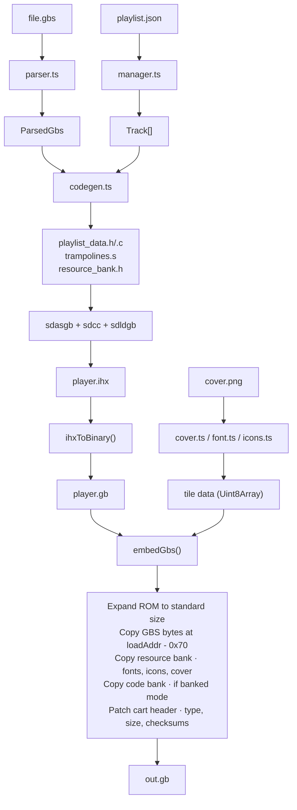

# Architecture

## Build Pipeline



### Key steps

1. **Parse GBS**: Extract header fields (loadAddr, initAddr, playAddr, stackPtr, track count) and determine the ROM offset where GBS data will be embedded.

2. **WRAM analysis**: Scan the GBS binary for direct WRAM references to find safe addresses for player variables and stack (see "Dynamic WRAM Placement" below).

3. **Code generation**: Produce `playlist_data.h` (compile-time constants), `playlist_data.c` (track list array), `trampolines.s` (entry point and bank-switching stubs), and `resource_bank.h` (tile data pointers).

4. **SDCC compilation**: Assemble `startup.s` and `trampolines.s` with sdasgb, compile C files with sdcc (`--nostdlib --no-std-crt0`), link with sdldgb.

5. **IHX conversion**: Custom `ihxToBinary()` replaces GBDK's `makebin` (which mishandles 32-byte IHX data records). Only ROM-space addresses (0x0000-0x7FFF) are extracted.

6. **GBS embedding**: Allocate a standard-size ROM, copy compiled player code, copy GBS data at `loadAddr - 0x70`, copy resource bank tile data, patch the cartridge header.

## ROM Layout

### Non-banked mode (high loadAddr)

When the GBS file's `loadAddr` is high enough that `gbsRomOffset >= 0x2000` (e.g. Pokemon Blue, loadAddr=0x3F56), the player code fits in bank 0 before the GBS data:

```
0x0000-0x003F  RST vectors (all RETI -- safe no-ops)
0x0040-0x0047  VBL ISR: jp _vbl_handler
0x0048-0x0063  Other ISR vectors (all RETI -- unused)
0x0100-0x0103  Entry point: NOP + JP _start
0x0104-0x0133  Nintendo logo (48 bytes -- verified by boot ROM)
0x0134-0x014F  Cartridge header (patched by embedGbs)
0x0150-~0x01CF Startup routine (_start) + VBL handler
0x0200-0x0202  Entry trampoline: JP _main
0x0380+        _CODE section: main, player, ui, input, playlist_data
...            0xFF padding
0x3EE6         GBS file start (header bytes)
0x3F56         GBS music code (at loadAddr)
0x4000-0x7FFF  GBS bank 1 data
0x8000+        GBS banks 2, 3, ...
Bank N         Resource bank: fonts, icons, cover tiles
```

### Banked mode (low loadAddr)

When the GBS file's `loadAddr` is low enough that `gbsRomOffset < 0x2000` (e.g. Pokemon Trading Card Game, loadAddr=0x0470), the GBS data would overwrite the `_CODE` section. The build tool detects this and places `_CODE` in a dedicated ROM bank:

```
0x0000-0x003F  RST vectors (all RETI)
0x0040-0x0047  VBL ISR: jp _vbl_handler
0x0100-0x0103  Entry point: NOP + JP _start
0x0104-0x014F  Nintendo logo + cartridge header
0x0150-~0x01CF Startup routine + VBL handler
0x0200-0x024C  Bank-0 trampolines:
                 _entry (switch to code bank, call _main)
                 _gbs_init_trampoline (call GBS INIT, restore code bank)
                 _gbs_play_trampoline (call GBS PLAY, restore code bank)
                 _banked_copy (switch bank, memcpy, restore code bank)
0x0400         GBS file start (header + music code at loadAddr)
...            GBS data spans banks 0-N
Bank N+1       Code bank: _CODE section (all C code)
Bank N+2       Resource bank: fonts, icons, cover tiles
```

The trampolines are always in bank 0 (always mapped at 0x0000-0x3FFF) and handle MBC1 bank switching around every cross-bank call. This is necessary because:

- GBS INIT/PLAY may switch banks internally (the GBS driver controls MBC writes)
- Resource data lives in a different bank than the executing code
- The code bank must be restored after every GBS call or resource copy

The `_TRAMPOLINE` area uses its own area name (not `_STARTUP`) to avoid sdasgb sub-area naming conflicts that cause 1-byte address shifts.

## GBS Compatibility Mechanisms

### Dynamic WRAM Placement

GBS sound drivers are extracted from running games and use WRAM addresses that the original game allocated. Different games use different WRAM regions, and some drivers read WRAM locations as control flags (e.g. Zelda reads 0xC10B as a playback mode selector). If the player's own variables land on these addresses, the driver malfunctions.

The build tool solves this by scanning the GBS binary for `FA` and `EA` opcodes -- the SM83 instructions for `LD A,(nn)` and `LD (nn),A` with direct 16-bit addresses. Any address in the 0xC000-0xDFFF range (WRAM) is marked as "used by the driver." The scan then finds 3 contiguous 256-byte pages that the driver does not reference, and places:

- `_DATA` section (player variables) at page N
- `_INITIALIZED` section at page N+1
- Player stack (growing downward) at the top of page N+2

These addresses are passed to the SDCC linker (`-b _DATA=...`, `-b _INITIALIZED=...`) and emitted into `playlist_data.h` as `PLAYER_STACK_PTR`. The `main()` function overrides SP at entry.

If no 3-page free block exists, the tool falls back to the legacy default (DATA=0xC100, STACK=0xC300) with a warning.

### HRAM Zeroing

GBS drivers often read HRAM flags that the original game sets but the driver itself never writes. For example, Zelda: Link's Awakening's PLAY routine reads HRAM 0xFFF3 -- if non-zero, it skips bank 1 and bank 2 sound update calls entirely, producing silence. The driver never writes to 0xFFF3; it is a game-state flag.

The startup code zeroes all of HRAM (0xFF80-0xFFFE, 127 bytes) before enabling the APU or calling any GBS code. Zero is the "normal playback" state for all known GBS drivers.

### Video Register Resets

GBS INIT and PLAY are extracted from running game code and write to video registers as side-effects (the original game used these to control scrolling, palettes, etc.). The player must reset these every frame:

- After `player_call_init()`: reset `NR52`, `NR50`, `NR51` (APU registers that INIT may disable)
- After `player_tick()` (every frame): reset `LCDC` (LCD control), `BGP` (background palette), `IE` (interrupt enable)
- In the main loop: reset `SCY`, `SCX` (scroll registers), `OBP0` (sprite palette), `WY`, `WX` (window position)

### VBlank Synchronization

The VBL ISR sets a flag in HRAM (`VBL_FLAG` at 0xFF80) each VBlank. The `vbl_wait()` function checks two conditions:

```c
while (!VBL_FLAG || LY_REG < 144u) {}
```

The dual check is necessary because GBS INIT can span multiple frames (interrupts remain enabled during the call), causing the ISR to fire mid-INIT and set a stale flag. Checking only `VBL_FLAG` would cause `vbl_wait()` to return immediately -- outside VBlank -- and VRAM writes would be silently dropped by the hardware.

### Stack in WRAM (Not HRAM)

The player stack must be in WRAM, not at the traditional 0xFFFE (top of HRAM). Many GBS drivers (e.g. Harvest Moon) use HRAM 0xFFE0-0xFFFE as APU shadow registers, bulk-copying channel state there every frame during PLAY. A stack at 0xFFFE would be overwritten, corrupting return addresses.

### GBS Call Convention

`player_call_init()` and `player_tick()` are `__naked` functions (no SDCC prologue/epilogue). Before calling GBS code:

1. Save the player SP to HRAM (0xFF95/0xFF96) -- WRAM is unsafe because GBS INIT may zero it
2. Switch SP to `GBS_STACK_PTR` (the value from the GBS header, typically 0xDFFF)
3. Call GBS INIT or PLAY (via trampoline in banked mode)
4. Restore SP from HRAM

`player_current_track` is backed up to HRAM (0xFF97) before PLAY and restored after, since GBS PLAY may corrupt WRAM variables.

## GBS File Format Reference

The GBS header is 112 bytes (0x70), little-endian:

| Offset | Size | Field | Description |
|--------|------|-------|-------------|
| 0x00 | 3 | magic | "GBS" |
| 0x03 | 1 | version | Always 1 |
| 0x04 | 1 | numSongs | Total track count |
| 0x05 | 1 | firstSong | 1-based default track |
| 0x06 | 2 | loadAddr | Where GBS code lives in GB memory (min 0x0470) |
| 0x08 | 2 | initAddr | Call with 0-based track index in register A |
| 0x0A | 2 | playAddr | Call every VBlank (or timer) interrupt |
| 0x0C | 2 | stackPtr | Expected SP value for the GBS code |
| 0x0E | 1 | timerModulo | TMA register value |
| 0x0F | 1 | timerControl | TAC register value; bit 6 = use timer interrupt |
| 0x10 | 32 | title | Null-padded ASCII |
| 0x30 | 32 | author | Null-padded ASCII |
| 0x50 | 32 | copyright | Null-padded ASCII |

GBS files contain no per-track titles -- those come from the playlist JSON.

The GBS file (header + music code) is embedded in the ROM at byte offset `loadAddr - 0x70`, so the music code lands at the correct Game Boy memory address at runtime.

## Font and Tile System

### Condensed font (proportional)

95 tiles covering ASCII 0x20-0x7E, loaded at VRAM 0x8000 (tile 0 = space). Used for the window overlay text (album title, now-playing name) via `blit_string()`, which renders glyphs at sub-tile pixel offsets into scratch tiles.

Per-character advance widths are computed at build time by scanning each glyph for the rightmost non-background pixel column, then adding 2 (1 for the pixel + 1 for inter-character gap). Widths are copied to WRAM at init so `blit_string()` never needs bank switching.

### Soft font (fixed-width)

102 tiles covering ASCII 0x20-0x85, loaded at VRAM 0x85F0 (starting at tile index 95, immediately after the condensed font). Tile 102 (0x85) is the ellipsis character. Used for the scrolling track list, where each character maps directly to a tilemap entry: `tile_index = SOFT_FONT_BASE + (ascii_code - 0x20)`.

### Scratch tiles

Tiles 197-228 are scratch space used by `blit_string()` for proportional rendering. The function reads glyph pixel data from the condensed font tiles in VRAM (already loaded), shifts bits to sub-tile positions, and OR-writes them into the scratch tiles. The window tilemap rows point to these scratch tiles.

### Resource bank

All tile data (both fonts, icons, cover art) lives in a dedicated ROM bank. At startup, `reload_tiles()` copies everything to VRAM via MBC1 bank switching. In banked-code mode, this uses the `_banked_copy` trampoline to avoid unmapping the executing code.

### VRAM write strategy

Bulk VRAM writes (font loading, track name blitting, full-screen redraws) always disable the LCD first. VRAM is only accessible during VBlank or when the LCD is off; trying to write during active display silently drops writes. Cycle-counting to stay within VBlank budget is unreliable with SDCC-generated code, so LCD disable is the robust approach.
