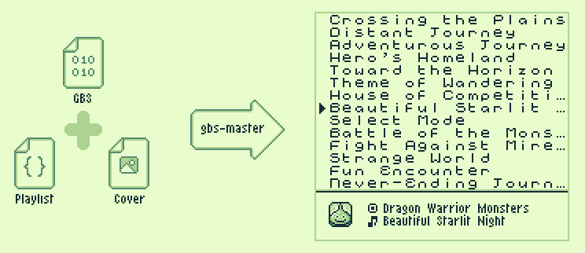

# `gbs-master`



Builds a Game Boy ROM (.gb) music player from any GBS sound file, with optional playlists and cover art.

### **[>>> Try it in your browser — no install required <<<](https://clifforj.github.io/gb-master/)**

## What it does

GBS (Game Boy Sound) files contain extracted music data and sound drivers from original Game Boy games. This tool takes a `.gbs` file and produces a playable `.gb` ROM with:

- A scrolling track list with cursor navigation
- Customisable track names and order
- A window overlay showing the now-playing track name, album title and cover image
- Controls: Up/Down to browse, A to play, Left/Right to skip
- Optional cover art
- Customisable icons

The ROM is compiled from C and assembly source using SDCC (no GBDK library) to avoid memory conflicts with GBS sound drivers.

There are two ways to build ROMs:

- **CLI** (Node.js + SDCC) — full build pipeline, compiles from source
- **Web app** — runs entirely in the browser using pre-compiled template ROMs, no toolchain needed

## Requirements

### CLI builds

- **[Node.js](https://nodejs.org/)** 20+
- **[GBDK-2020](https://github.com/gbdk-2020/gbdk-2020)** -- only the SDCC toolchain binaries are used (`sdcc`, `sdasgb`, `sdldgb`). The GBDK library itself is not used.

### Web app

- A modern browser (no other dependencies)

### Installing GBDK-2020 (CLI only)

1. Download the latest release for your platform from the [GBDK-2020 releases page](https://github.com/gbdk-2020/gbdk-2020/releases).
2. Extract the archive to a location of your choice (e.g. `~/gbdk` or `C:\gbdk`).
3. Set the `GBDK_HOME` environment variable to the extracted folder, or pass `--gbdk-home` on the command line each time you build.

```bash
# Example: set GBDK_HOME in your shell profile
export GBDK_HOME=~/gbdk
```

## Quick start

### CLI

```bash
npm install
npm run build:rom -- <file.gbs> -o player.gb --gbdk-home /path/to/gbdk
```

### Web app

```bash
cd web && npm install && npm run dev
```

Open the local URL in your browser, drop a `.gbs` file, edit track names, and download the ROM. No SDCC toolchain required.

## CLI reference

### `build:rom`

Build a Game Boy ROM from a GBS file.

```bash
npm run build:rom -- <file.gbs> -o player.gb
npm run build:rom -- <file.gbs> --playlist tracks.json -o player.gb
```

| Flag | Description |
|---|---|
| `-o, --output <path>` | Output `.gb` file path (required) |
| `--playlist <path>` | Playlist JSON with track titles |
| `--cover <path>` | Album cover PNG (16x16, GBStudio palette) |
| `--gbdk-home <path>` | Path to GBDK-2020 installation root |

### `playlist:init`

Generate a template playlist JSON file from a GBS file. Edit the generated file to add track titles.

```bash
npm run playlist:init -- <file.gbs>
```

## Playlist JSON format

```json
{
  "gbs": "game.gbs",
  "title": "Album Title",
  "tracks": [
    { "number": 1, "title": "Opening Theme" },
    { "number": 2, "title": "Battle Music" },
    { "number": 5, "title": "Credits" }
  ]
}
```

- `number`: 1-based GBS track number
- `title`: Display name (max ~30 characters)
- Only listed tracks are included in the ROM -- omit tracks you don't want

## Custom assets

- **Cover art**: 16x16 PNG using the GBStudio Classic 4-color palette. Displayed in the window overlay.
- **Font PNGs/2bpp**: 128x112 sprite sheets in `rom/assets/font/`. `condensed.png` for proportional rendering, `soft.2bpp` for the fixed-width track list.
- **Icon PNGs**: 8x8 sprites in `rom/assets/icons/` for cursor, now-playing, album, and track indicators.

All PNGs use the GBStudio Classic palette: `#E0F8CF` (white), `#87C06A` (light gray), `#2E6850` (dark gray), `#071821` (black), `#FF00FF` (transparent).

## How it works

### CLI pipeline

The build tool parses the GBS header, generates an assembly config table and trampoline stubs, compiles a Game Boy ROM using SDCC, then embeds the GBS music data at the correct ROM offset and patches the cartridge header. The GBS sound driver runs natively -- the player just calls its INIT and PLAY entry points each frame.

### Web app pipeline

The web app uses pre-compiled template ROMs (built once with `npx tsx scripts/build-templates.ts`). At runtime it parses the GBS file in the browser, selects the right template based on banked/non-banked mode and WRAM variant, then binary-patches the config table, trampoline call targets, GBS data, and resource bank directly into the template. No compilation step is needed.

See [ARCHITECTURE.md](ARCHITECTURE.md) for details.

## Compatibility

Tested with:

- Pokemon Blue
- Zelda: Link's Awakening
- Harvest Moon GB
- Pokemon Trading Card Game
- Dragon Warrior Monsters
- ...and a few more

The build tool automatically handles GBS driver conflicts (WRAM placement, HRAM flags, banked code for low-loadAddr files).

## Fonts

A big thanks to both `edo999` and `reakain` for their work on GB fonts

> Condensed font pack by `edo999` (edo999.itch.io) - licensed under [Creative Commons Attribution-NoDerivatives 4.0 International License](http://creativecommons.org/licenses/by-nd/4.0/) - [link to source](https://edo999.itch.io/condensed-fonts)

> Soft Gameboy font pack by `reakain` (reakain.itch.io) - No redistribution, free use and modification [link to source](https://reakain.itch.io/soft-gameboy-font)